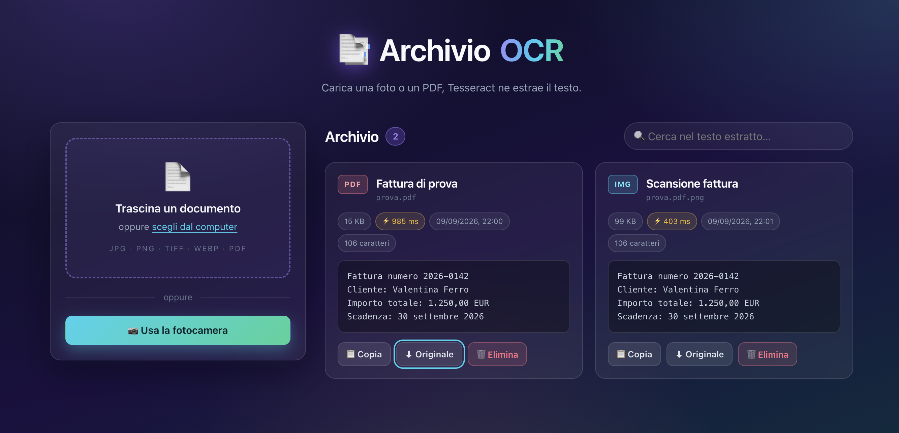
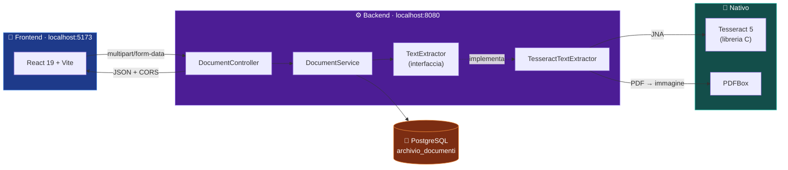
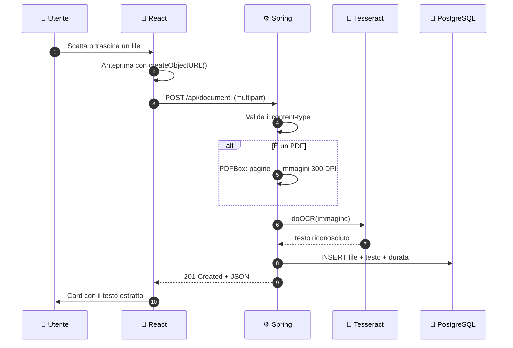
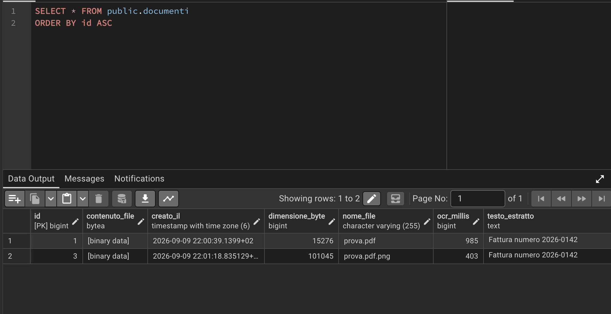

<div align="center">

# 📑 Archivio OCR

### Carica una foto o un PDF, l'applicazione ne estrae il testo ✨

[](https://openjdk.org/)
[](https://spring.io/projects/spring-boot)
[](https://react.dev/)
[](https://vite.dev/)

[](https://www.postgresql.org/)
[](https://github.com/tesseract-ocr/tesseract)
[](https://pdfbox.apache.org/)

</div>

---

<div align="center">



</div>

---

## 🎬 Cosa fa

| | Funzione | Descrizione |
|:--:|---|---|
| 🖼️ | **Import da file** | Drag & drop oppure selezione classica |
| 📷 | **Fotocamera** | Anteprima video live e scatto direttamente dal browser |
| 📕 | **PDF multipagina** | Ogni pagina renderizzata a 300 DPI e passata all'OCR |
| 🔤 | **OCR bilingue** | Italiano + inglese insieme (`ita+eng`) |
| 🔍 | **Ricerca full-text** | Filtra i documenti sul **testo riconosciuto**, non sul nome |
| ⚡ | **Metriche** | Durata dell'OCR salvata e mostrata per ogni documento |
| 💾 | **Archivio** | File originale e testo estratto conservati su PostgreSQL |

---

## 🏗️ Architettura



> 💡 **Il punto chiave del progetto:** service e controller dipendono solo dall'interfaccia
> `TextExtractor`. **Nessuno di loro sa che esiste Tesseract.** Sostituire il motore OCR
> significa scrivere una nuova implementazione, senza toccare nient'altro.

### 🔄 Il flusso di una richiesta



---

## 📦 Requisiti

| Componente | Versione | Note |
|---|:--:|---|
| ☕ JDK | 25 | il progetto usa `java.version=25` |
| 🔨 Maven | — | incluso come wrapper (`./mvnw`) |
| 🟩 Node.js | 20+ | testato su 24 |
| 🐘 PostgreSQL | 14+ | in ascolto su `localhost:5432` |
| 👁️ Tesseract OCR | 5.x | **installazione di sistema**, non è una libreria Java |

### 👁️ Installare Tesseract

> ⚠️ Tesseract è scritto in **C**: va installato sul sistema operativo.
> La dipendenza Maven `tess4j` è soltanto il ponte Java verso di esso.

```bash
# 🍎 macOS
brew install tesseract tesseract-lang

# 🐧 Ubuntu / Debian
sudo apt install tesseract-ocr tesseract-ocr-ita
```

Verifica installazione e lingue disponibili:

```bash
tesseract --version
# tesseract 5.5.3
#  leptonica-1.87.0

ls $(brew --prefix)/share/tessdata | grep -E "ita|eng"
# eng.traineddata
# ita.traineddata
```

---

## ⚙️ Configurazione

### 1️⃣ Database

```bash
createdb -h localhost -U postgres archivio_documenti
```

Le tabelle le crea Hibernate al primo avvio (`spring.jpa.hibernate.ddl-auto=update`).
Adatta se serve username e password in `BE/src/main/resources/application.properties`.

### 2️⃣ Percorsi OCR

```properties
ocr.tessdata-path=/opt/homebrew/share/tessdata   # 📚 cartella dei file .traineddata
ocr.language=ita+eng                             # 🔤 lingue riconosciute
ocr.native-lib-path=/opt/homebrew/lib            # 🔧 cartella di libtesseract.dylib/.so
```

> 🚨 **`ocr.native-lib-path` è il punto più delicato del progetto.**
> `tess4j` include le librerie native precompilate solo per Windows e Linux x86: su
> **Mac ARM** non le trova e l'applicazione fallisce con
> `UnsatisfiedLinkError: Unable to load library 'tesseract'`.
> Questa property viene tradotta in `jna.library.path` dentro `OcrConfig`, dicendo a JNA
> dove cercare. Su Linux, dove le librerie stanno già in `/usr/lib`, può restare vuota.

<details>
<summary>📍 <b>Percorsi tipici per piattaforma</b> (clicca per aprire)</summary>

<br>

| Sistema | `tessdata-path` | `native-lib-path` |
|---|---|---|
| 🍎 macOS (Apple Silicon) | `/opt/homebrew/share/tessdata` | `/opt/homebrew/lib` |
| 🍎 macOS (Intel) | `/usr/local/share/tessdata` | `/usr/local/lib` |
| 🐧 Ubuntu / Debian | `/usr/share/tesseract-ocr/5/tessdata` | *(vuoto)* |

</details>

---

## 🚀 Avvio

Servono **due terminali**.

```bash
# 🖥️ Terminale 1 — backend su http://localhost:8080
cd BE
./mvnw spring-boot:run
```

```bash
# 🎨 Terminale 2 — frontend su http://localhost:5173
cd FEJSX
npm install     # solo la prima volta
npm run dev
```

### 👉 Apri **http://localhost:5173**

> ⚡ Il frontend ha l'*hot module replacement*: salvi un file in `src/` e il browser si
> aggiorna da solo, senza ricaricare la pagina. Il backend invece va **riavviato** a ogni
> modifica dei sorgenti Java.

---

## 🔌 API

Base URL: `http://localhost:8080/api/documenti`

| | Metodo | Percorso | Descrizione | Risposta |
|:--:|:--:|---|---|:--:|
| 📤 | `POST` | `/` | Carica un file ed esegue l'OCR | `201` |
| 📋 | `GET` | `/` | Elenco di tutti i documenti | `200` |
| 🔎 | `GET` | `/{id}` | Un singolo documento | `200` |
| ⬇️ | `GET` | `/{id}/file` | Scarica il file originale | `200` |
| 🗑️ | `DELETE` | `/{id}` | Elimina un documento | `204` |

Campi multipart del `POST`: **`file`** (obbligatorio) e **`titolo`** (opzionale, default = nome del file).

### 💻 Esempio reale

```bash
curl -X POST http://localhost:8080/api/documenti \
     -F "file=@fattura.pdf" \
     -F "titolo=Fattura settembre"
```

```json
{
  "id": 1,
  "titolo": "Fattura settembre",
  "nomeFile": "prova.pdf",
  "tipoFile": "application/pdf",
  "dimensioneByte": 15276,
  "testoEstratto": "Fattura numero 2026-0142\nCliente: Valentina Ferro\nImporto totale: 1.250,00 EUR\nScadenza: 30 settembre 2026",
  "ocrMillis": 985,
  "creatoIl": "2026-09-09T20:00:39.139900Z"
}
```

### ✅ Formati accettati


📏 Limiti di upload: **20 MB** per file, **25 MB** per richiesta.

### 🚦 Codici di errore

| | Codice | Quando succede | Esempio |
|:--:|:--:|---|---|
| 🟠 | `400` | File mancante o tipo non supportato | caricamento di un `.docx` |
| 🔵 | `404` | Documento inesistente | `GET /api/documenti/999` |
| 🟣 | `413` | File oltre i 20 MB | — |
| 🔴 | `422` | File valido, ma l'OCR non è riuscito a elaborarlo | PDF protetto da password, immagine corrotta, Tesseract assente |

Tutti gli errori hanno lo stesso corpo, prodotto da `GlobalExceptionHandler`:

```json
{
  "timestamp": "2026-09-09T20:01:30.264584Z",
  "status": 400,
  "error": "Bad Request",
  "message": "Tipo di file non supportato: text/plain. Ammessi: immagini e PDF."
}
```

> 💡 **Perché 422 e non 500?** `422 Unprocessable Entity` significa "la richiesta era
> formalmente corretta, ma il contenuto non sono riuscito a elaborarlo". Non è un `400`
> (l'utente non ha sbagliato la richiesta) né un `500` (non è un bug del server):
> il file semplicemente non era leggibile dall'OCR.

---

## 🐘 I dati sul database

Il testo estratto viene salvato **insieme** al file originale, così la ricerca lavora sul
contenuto senza dover rifare l'OCR ogni volta.



```sql
SELECT id, nome_file, ocr_millis, left(testo_estratto, 40) AS anteprima
FROM documenti
ORDER BY id;
```

| id | nome_file | ocr_millis | anteprima |
|:--:|---|:--:|---|
| 1 | `prova.pdf` | 985 | Fattura numero 2026-0142… |
| 3 | `prova.pdf.png` | 403 | Fattura numero 2026-0142… |

> 🎯 Le due righe contengono **lo stesso identico testo** pur essendo arrivate da due
> percorsi diversi: la prima via PDFBox, la seconda via ImageIO. È la conferma che i due
> rami del codice concordano.

---

## 📂 Struttura del progetto

```
📁 U5W4D3
├── 📁 BE                                   ⚙️ Spring Boot
│   └── src/main/java/com/example/demo/
│       ├── 📁 config
│       │   └── WebConfig.java              🌐 CORS per il frontend Vite
│       ├── 📁 controllers
│       │   └── DocumentController.java     🔌 endpoint REST
│       ├── 📁 dto                          📦 DocumentResponseDTO, ErrorResponseDTO
│       ├── 📁 entities
│       │   └── Document.java               🗃️ entity JPA (file + testo estratto)
│       ├── 📁 exceptions                   🚦 GlobalExceptionHandler, DocumentNotFound…
│       ├── 📁 ocr                          👁️ IL CUORE DEL PROGETTO
│       │   ├── TextExtractor.java          🔗 interfaccia: l'app dipende solo da questa
│       │   ├── TesseractTextExtractor.java 🔧 unica classe che nomina Tesseract
│       │   ├── OcrConfig.java              ⚙️ bean prototype + jna.library.path
│       │   ├── OcrProperties.java          📝 property con prefisso "ocr"
│       │   ├── ExtractedText.java          📄 record: testo + durata
│       │   └── OcrException.java           🔴 errore di dominio → 422
│       ├── 📁 repositories                 💾 DocumentRepository
│       └── 📁 services
│           └── DocumentService.java        🧠 validazione e orchestrazione
│
├── 📁 FEJSX                                🎨 React + Vite
│   └── src/
│       ├── 📁 api
│       │   └── documenti.js                📡 tutte le fetch, in un punto solo
│       ├── 📁 components
│       │   ├── Uploader.jsx                📥 drag & drop + selezione file
│       │   ├── Fotocamera.jsx              📷 getUserMedia + scatto su canvas
│       │   ├── ListaDocumenti.jsx          📋 griglia + ricerca
│       │   └── CardDocumento.jsx           🗂️ singolo documento
│       └── App.jsx                         🧩 stato condiviso
│
└── 📁 docs                                 🖼️ screenshot
```

### 🧠 Scelte progettuali

| | Scelta | Perché |
|:--:|---|---|
| 🔗 | **`TextExtractor` come interfaccia** | Cambiare motore OCR non tocca service né controller |
| 🧵 | **Bean Tesseract `prototype`** | Un'istanza di `Tesseract` **non è thread-safe**: ogni richiesta ne riceve una propria |
| 📕 | **PDF renderizzati con PDFBox** | Tesseract legge solo immagini: ogni pagina diventa un'immagine a 300 DPI (max 20 pagine) |
| 🛡️ | **Eccezioni di dominio** | Gli errori delle librerie native non escono mai dal package `ocr` |
| ⏱️ | **OCR sincrono** | Il `POST` risponde a elaborazione conclusa: semplice e adatto a file singoli |

> 🔭 **Evoluzione naturale:** con volumi maggiori l'OCR andrebbe reso asincrono —
> `202 Accepted` immediato e notifica del risultato a parte (il progetto ha già
> `spring-boot-starter-websocket` tra le dipendenze).

---

## 📷 Note sulla fotocamera

Il pulsante **Usa la fotocamera** apre l'anteprima live con `getUserMedia()`; lo scatto viene
disegnato su un `<canvas>` alla risoluzione nativa del video e convertito in un `File` PNG,
identico a uno scelto dal disco.

- 🔒 Funziona solo in **secure context**: `localhost` va bene, ma aprendo il sito dall'IP di
  rete (`192.168.x.x:5173`) il browser bloccherà la fotocamera finché non c'è **HTTPS**.
- 🖼️ Lo scatto è in **PNG e non JPEG**: la compressione JPEG introduce artefatti sui bordi
  delle lettere e peggiora il riconoscimento.
- 📱 Sui telefoni viene preferita la fotocamera posteriore (`facingMode: 'environment'`).
- 🔌 La webcam viene **spenta nel cleanup di `useEffect`**: senza, la lucina resta accesa
  anche dopo aver chiuso il pannello. È l'errore più comune con `getUserMedia`.

---

## 🆘 Risoluzione dei problemi

<details open>
<summary><b>Clicca per aprire/chiudere</b></summary>

<br>

| | Sintomo | Causa e rimedio |
|:--:|---|---|
| 🔧 | `422` «Tesseract non disponibile: Unable to load library 'tesseract'» | JNA non trova la libreria nativa → correggi **`ocr.native-lib-path`** |
| 📚 | `422` «Tesseract non è riuscito a leggere il documento» | Di solito `ocr.tessdata-path` sbagliato o lingua mancante (`ita.traineddata`) |
| 🌐 | Errore **CORS** nella console del browser | Il frontend gira su una porta diversa da 5173 → aggiungi l'origine in `WebConfig` |
| 🔌 | «Impossibile connettersi» nel frontend | Backend non avviato, oppure PostgreSQL non in esecuzione |
| 🔤 | Testo estratto illeggibile o vuoto | Immagine a risoluzione troppo bassa: servono **almeno 300 DPI** |
| 📷 | Fotocamera bloccata | Serve HTTPS fuori da `localhost`; controlla il permesso nella barra degli indirizzi |

</details>

---

## 🎯 Qualità dell'OCR: cosa aspettarsi

Tesseract dà ottimi risultati su scansioni e PDF nativi, ma peggiora sensibilmente con foto
storte, in ombra o a bassa risoluzione.

| | Consiglio |
|:--:|---|
| 📐 | Inquadra il documento **dritto** e riempi il fotogramma |
| 💡 | Evita **ombre e riflessi** |
| ⚫ | Preferisci sfondo chiaro con testo scuro |
| 🔍 | Almeno **300 DPI**: sotto, l'OCR restituisce caratteri casuali |

> 💭 **Miglioramento futuro:** per i PDF **nativi** (non scansionati) l'estrazione diretta
> del testo con PDFBox sarebbe più precisa e istantanea dell'OCR. Oggi il progetto li tratta
> tutti come immagini.

---

<div align="center">

**Progetto didattico** · EPICODE U5W4D3 · Backend Java

Made with ☕ Java, ⚛️ React e 👁️ Tesseract

</div>
